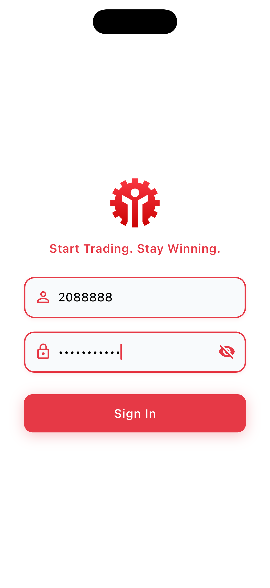
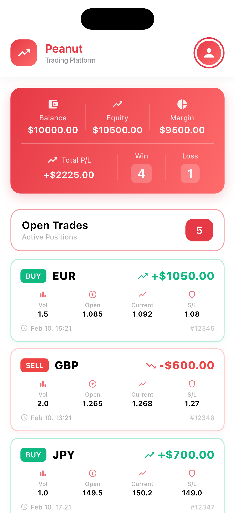
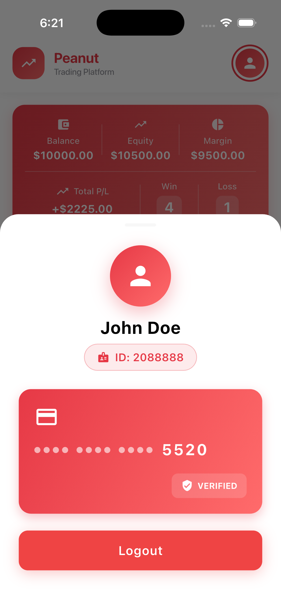

# Peanut

A modern Flutter trading application that provides real-time trade monitoring, portfolio management, and comprehensive trading analytics.

## Screenshots

<table>
  <tr>
    <td align="center">
      
      <br />
      <b>Splash Screen</b>
    </td>
    <td align="center">
      
      <br />
      <b>Authentication</b>
    </td>
  </tr>
  <tr>
    <td align="center">
      
      <br />
      <b>Home Screen</b>
    </td>
    <td align="center">
      
      <br />
      <b>Profile Menu</b>
    </td>
  </tr>
</table>

## Download


<div style="text-align:center; margin: 24px 0;">
  <a href="assets/apk/peanut.apk"
     style="
       display:inline-block;
       padding:14px 30px;
       background:#2E7D32;
       color:#fff;
       text-decoration:none;
       border-radius:50px;
       font-size:16px;
       font-weight:800;
       letter-spacing:0.5px;
     ">
    ⬇ DOWNLOAD PEANUT APK
  </a>
</div>


## Features

### Core Functionality
- Real-time Trade Monitoring - Track open trades with live profit/loss updates
- Portfolio Overview - View balance, equity, and margin at a glance
- Trade Analytics - Comprehensive statistics including win/loss ratios
- Credit Card Integration - Secure payment method management
- User Profile - Personalized user information and settings
- Secure Authentication - Phone-based login system

### UI/UX Highlights
- Modern Design - Clean, intuitive interface with gradient accents
- Dark/Light Themes - Adaptive color schemes for better readability
- Smooth Animations - Shimmer loading states and haptic feedback
- Responsive Layout - Optimized for all screen sizes using ScreenUtil
- Pull-to-Refresh - Easy data updates with swipe gesture

## Architecture

### Project Structure
```
lib/
├── app/
│   ├── core/
│   │   ├── base/              # Base classes and utilities
│   │   ├── config/            # App configuration
│   │   ├── constants/         # App constants
│   │   ├── helper/            # Helper utilities
│   │   │   ├── app_helper.dart
│   │   │   ├── app_widgets.dart
│   │   │   ├── auth_helper.dart
│   │   │   ├── dialog_helper.dart
│   │   │   ├── haptic_helper.dart
│   │   │   └── shared_value_helper.dart
│   │   ├── services/          # Network and API services
│   │   ├── style/             # App styling (colors, text styles)
│   │   └── widget/            # Reusable widgets
│   ├── data/
│   │   └── remote/
│   │       ├── model/         # Data models
│   │       └── repository/    # Repository pattern implementation
│   ├── modules/
│   │   ├── auth/              # Authentication module
│   │   ├── home/              # Home/Trading module
│   │   └── splash/            # Splash screen module
│   └── routes/                # App navigation
└── main.dart
```

### Design Patterns
- **MVC Pattern** - Model-View-Controller architecture
- **Repository Pattern** - Abstracted data layer
- **Dependency Injection** - GetX dependency management
- **State Management** - Reactive programming with GetX
- **Singleton Pattern** - Shared instances for helpers

## Tech Stack

### Core
- **Flutter SDK** (^3.10.8) - Cross-platform UI framework
- **Dart** - Programming language

### State Management & Navigation
- **GetX** (^4.7.3) - State management, dependency injection, and routing

### Networking
- **Dio** (^5.7.0) - HTTP client for API calls
- **Logger** (^2.5.0) - Beautiful logging
- **Connectivity Plus** (^4.0.2) - Network connectivity monitoring

### UI/UX
- **Flutter ScreenUtil** (^5.9.3) - Responsive design
- **Shimmer** (^3.0.0) - Loading animations
- **Flutter EasyLoading** (^3.0.5) - Loading indicators

### Utilities
- **Shared Value** (^3.0.0) - Persistent storage
- **Intl** (^0.20.1) - Internationalization
- **Easy Debounce** (^2.0.3) - Debouncing utility
- **Flutter Dotenv** (^5.2.1) - Environment configuration


## Security Features

- **Code Obfuscation** - Production builds are obfuscated
- **Secure Storage** - Sensitive data encrypted
- **API Authentication** - Token-based authentication
- **ProGuard Rules** - Custom rules for release builds
- **SSL Pinning Ready** - Network security prepared
